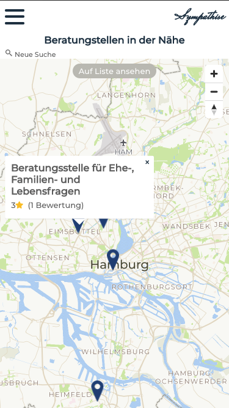

# sympathise

### About the app

sympathise makes it easy to find qualified social counseling centers for advice, support and professional help in a personal crisis or for your loved ones. You can quickly and reliably find addresses, phone numbers and online counseling services with reviews from the community.

Try it out: https://sympathise.herokuapp.com/

### Tech Stack

- Java 
- Spring Boot
- Spring Security
- Spring Data
- JUnit
- Lombok
- JsonWebToken
- Docker
- CI/CD
- JavaScript
- HTML5
- CSS3
- React 
- Axios
- ReactQuery
- JWT-Decode
- Styled-Components
- Git
